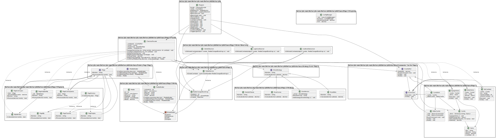

# DeliveryGo 

Proyecto desarrollado en **C# (consola)** para la materia **Programación II - Tecnicatura Superior en Desarrollo de Software**.  
El objetivo es construir un **checkout de e-commerce en consola**, aplicando distintos **patrones de diseño de software**.  

---

## Autores
- **Tadeo Patané**  
- **Ezequiel Bergamini**

---

## Contexto
El cliente solicitó un **checkout simple** para una demo comercial.  
Las restricciones fueron:
- Sin frameworks ni UI pesada.  
- Consola + C# puro.  
- Aplicar patrones de diseño de manera organizada.  

El sistema **DeliveryGo** permite:  
- Manejar un **carrito de compras** con soporte de **Undo/Redo** (Command).  
- Calcular costos de envío mediante **Strategy** y valores de configuración global (**Singleton**).  
- Procesar pagos usando **Factory**, **Adapter** (SDK externa simulada) y **Decorator** (IVA / Cupón).  
- Construir pedidos con **Builder**, notificar cambios mediante **Observer**, y simplificar todo con una **Facade**.  
- Proveer un **menú interactivo en consola** para operar con el sistema.  

---

## Organización del Proyecto
El código está estructurado en carpetas según cada etapa/patrón:
├── Command/ # Carrito con Commands (Agregar, Quitar, SetCantidad, Undo/Redo)
├── Strategy/ # Estrategias de envío (Moto, Correo, Retiro)
├── Singleton/ # Configuración global (IVA, umbral de envío gratis)
├── Payment/ # Pagos (Factory, Adapter, Decorator)
├── Order/ # Pedidos (Builder, Observer)
└── Facade/ # CheckoutFacade para orquestar todo

---

## Patrones Implementados
- **Command** → Carrito de compras con Undo/Redo.  
- **Strategy** → Diferentes formas de calcular envío.  
- **Singleton** → Configuración centralizada (IVA, envío gratis).  
- **Factory** → Creación de métodos de pago.  
- **Adapter** → Integración con SDK externa simulada.  
- **Decorator** → Aplicación de IVA y cupones.  
- **Builder** → Construcción de pedidos paso a paso.  
- **Observer** → Notificación de cambios de estado en pedidos.  
- **Facade** → Simplificación del uso de todo el sistema.

---

## División de Tareas
- **Tadeo Patané** →  Etapa 2 (Strategy + Singleton) y Etapa 4 (Menú de consola e integración final).
- **Ezequiel Bergamini** → Etapa 1 (Carrito + Command) y Etapa 3 (Pagos + Builder + Observer + Facade).

